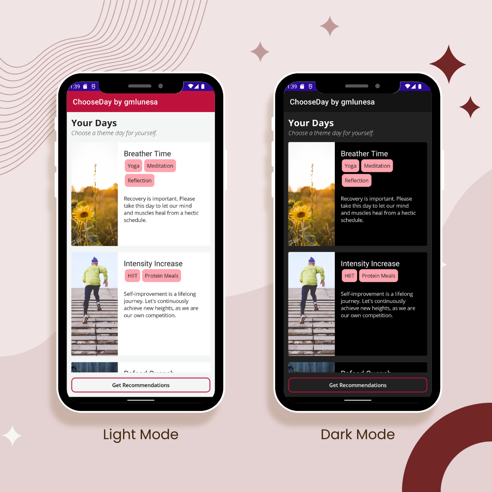
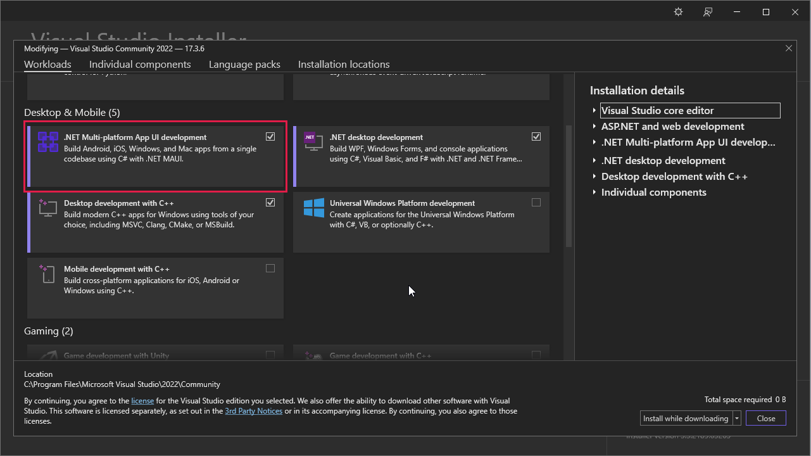
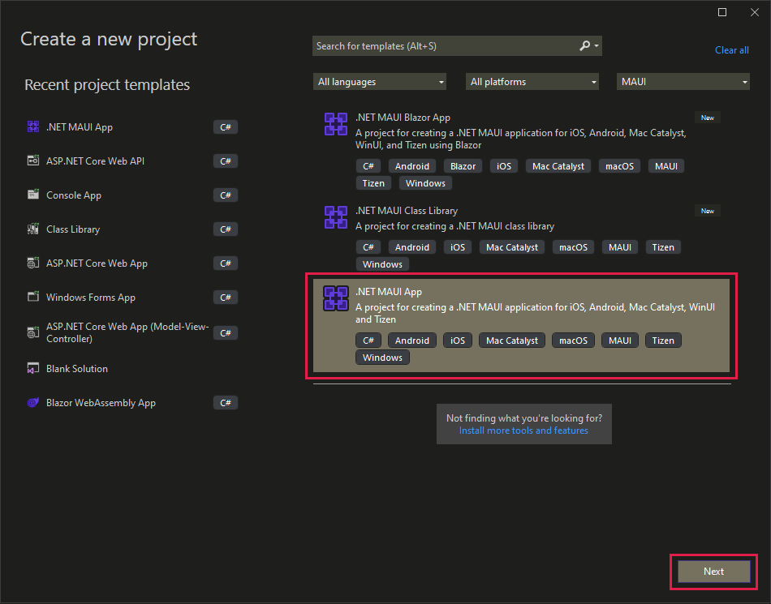
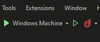
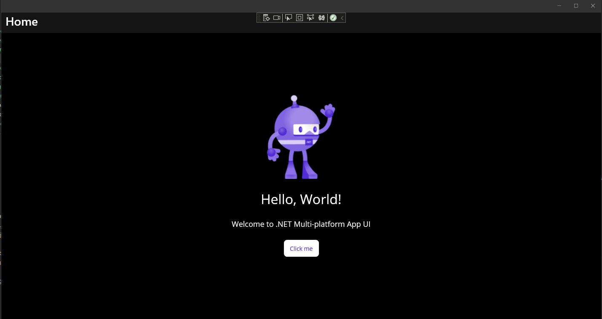
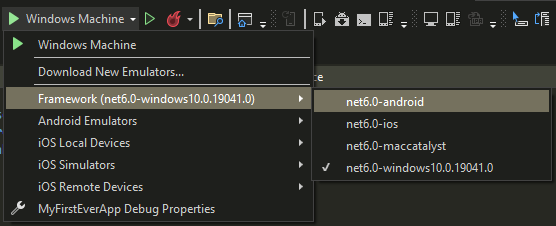
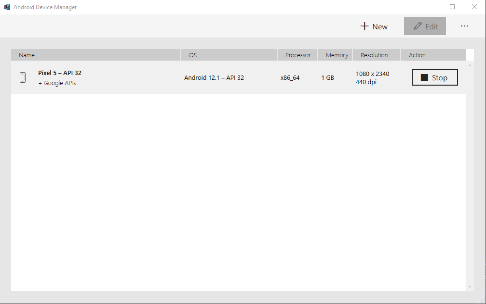
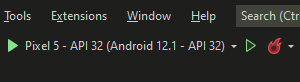
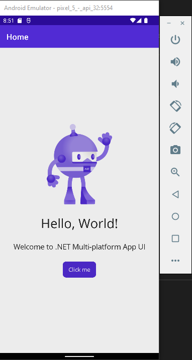
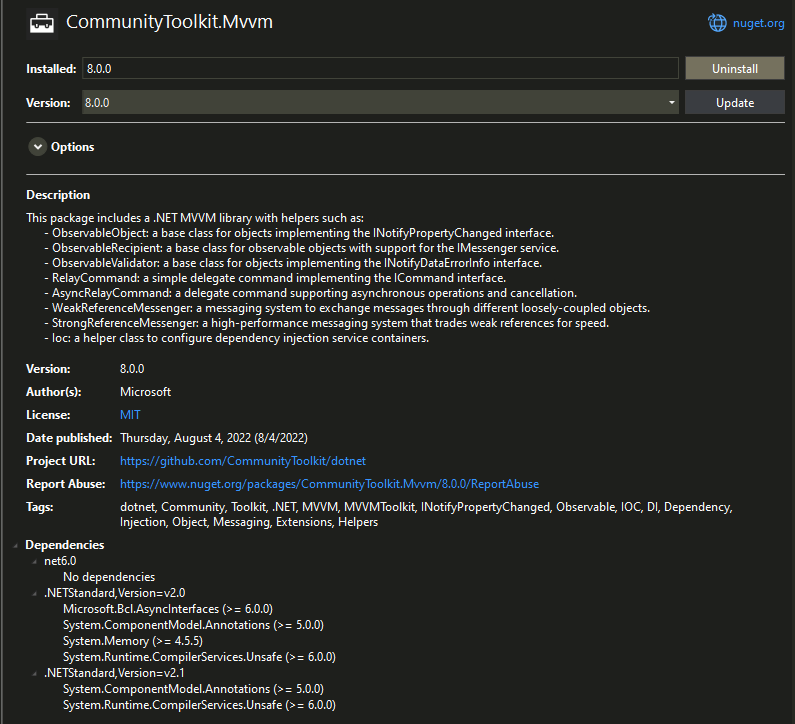

In today's blog, we will be creating a simple cross-platform application with .NET MAUI. I'll be providing a general walk-through and useful resources so you can build your own app as well!

<p class="my-6">
  
</p>

<!-- [.NET MAUI app mockup](./mockup.png) -->

The app, which I called ChooseDay, shows different types of recommended themed days. It retrieves data from a server and displays them accordingly. With .NET MAUI, this runs on Android, Windows, iOS and Mac (although I haven't personally tested with the last two since I don't have an Apple device).

## Introduction

I heard some buzz about .NET MAUI a couple of months ago during the .NET Conf: Focus on MAUI last August. However, I haven't really taken a closer look about it until coming across [James Montemagno](https://www.youtube.com/c/JamesMontemagno)'s Youtube channel. I downloaded the .NET Multi-platform App UI development workload in my VS2022, started coding and got honestly impressed with how easy and seamless it was to set up an app that could run across multiple platforms!

### About .NET MAUI

.NET Multi-platform App UI, or .NET MAUI in short, is cross-platform framework from Microsoft for creating native mobile and desktop apps with C# and XAML. Through .NET MAUI, we can write and develop apps that can run on Android, iOS, macOS, and Windows all from a single shared code-base. Through this, elements like UI layout and design, tests and business logic for different platforms that you or your organization supports are unified and consolidated. _Write once, run anywhere_. How powerful is that?

### Supported platforms

- Android 5.0 (API 21) or higher
- iOS 10 or higher
- macOS 10.13 or higher (using Mac Catalyst)
- Windows desktop and UWP, using WinUI 3
- Tizen, supported by Samsung
- Linux, supported by the community

### Native performance

- .NET MAUI for Android performs just-in-time (JIT) compilation to a native assembly.
- .NET MAUI for iOS does full ahead-of-time (AOT) compilation to produce a native ARM assembly code.
- .NET MAUI for macOS apps utilizes Mac Catalyst and supplements with additional AppKit and platform APIs.
- .NET MAUI for Windows uses the Windows UI 3 (WinUI 3) library.

## Setup

Let's go through the setup and installation part. Please take note that I am using my Windows machine for this blog's tutorial.

### Creating our project

To start developing, we would need to have [Visual Studio 2022](https://visualstudio.microsoft.com/vs/). Using the Visual Studio Installer, please select the **.NET Multi-platform App UI development** workload and install accordingly.

<p class="my-6">
  
</p>

Let's now create a new project to get everything ready.

- Open **Visual Studio 2022**.
- Click the **Create a new project** button.
- In the **All project types** drop-down, select **MAUI**.
- Click the **.NET MAUI App** template and press **Next**.

<p class="my-6">
  
</p>

- Please configure your project accordingly (Project name, location and solution name).
- Please choose at least **.NET 6.0** as the framework.

⚠️ Upon creating a project, you may encounter a Windows Security Alert that contains a warning regarding the firewall blocking some features. Please select **Allow access**.

### First test run

Let's do a test run on our first ever MAUI app. In the Visual Studio toolbar, please press the **Windows Machine** button to build and run the app. It is set as the default debug target.

<p class="my-6">
  
</p>

Ta-da! Our first cross-platform app using .NET MAUI is up and running. I am using Windows dark theme hence the color.

<p class="my-6">
  
</p>

⚠️ If Developer Mode is not yet enabled on your machine, you may encounter an **Enable Developer Mode for Windows** dialog. Please follow the instructions accordingly.

We can also run this using an Android emulator. To do so, please click the debug target drop-down menu, and select **net6.0-android** under **Framework**.

<p class="my-6">
  
</p>

⚠️ If you haven't accepted the Android SDK license yet, please check the **Error List** window. You may see an error detailing that the Android Sdk licenses must be accepted. Please accept accordingly.

You'll see the Android Emulator selected in the debug target drop-down menu if this is your first time building a .NET MAUI app. Please click the button. A **New Device** window will open and will guide you through the download and setup of an emulator image.

<p class="my-6">
  
</p>

After successfully downloading and setting up an emulator image, you may now select it as the debug target.

<p class="my-6">
  
</p>

Our app will now run in the Android emulator! Please take note that it may take a while during the first time.

<p class="my-6">
  
</p>

If you have any questions in the installation and setup, please check this [Microsoft tutorial](https://dotnet.microsoft.com/en-us/learn/maui/first-app-tutorial/intro).

### Project structure

Let's briefly cover the default files in our starter project.

📄 **App.xaml**: Contains the application resources that the app will use in the XAML layout.

📄 **App.xaml.cs** - Defines the App class which represents the application at runtime.

📄 **AppShell.xaml** - Contains the main structure of a .NET MAUI application.**MainPage.xaml** - Contains the user interface definition.

📄 **MainPage.xaml.cs** - Defines the logic for event handlers and actions triggered by the controls on the related page.

📄 **MauiProgram.cs** - Enables the app to be initialized in a single entry position.

📁 **/Platforms** - Contains initialization code files and resources for different supported platforms.

📁 **/Resources** - Contains application resources that define default styles and colors for each built-in control of .NET MAUI.

You may also refer to the official [Microsoft training documentation](https://learn.microsoft.com/en-us/training/modules/build-mobile-and-desktop-apps/3-create-a-maui-project-visual-studio#net-maui-project-structure-and-application-startup) for more information.

## Coding

Now that we have covered the basics, it is now time to code!

### Dependencies

In this project, we will be using the Model-View-ViewModel (MVVM) design pattern. Please install **CommunityToolkit.Mvvm** via Nuget.

<p class="my-6">
  
</p>

### Model

Let's make a class to represent the Day object, which will contain the details of each of the themed days.

- Create folder called `Models`.
- Create a file called `Day.cs` inside the newly created `Models` folder.
- Copy and paste the following.

```cs
public class Day
{
  public string Name { get; set; }
  public string Description { get; set; }
  public List<string> Activities { get; set; }
  public Uri Image { get; set; }
}
```

### Services

Let's create a service that will contain our retrieval of data from the server.

- Create folder called `Services`.
- Create a file called `MyDayService.cs` inside the newly created `Services` folder.
- Copy and paste the following.

```cs
/// <summary>
/// This service will handle HTTP requests to retrieve data from the cloud
/// </summary>
public class MyDayService
{
  HttpClient httpClient;
  List<Day> days = new();

  public MyDayService()
  {
    httpClient = new HttpClient();
  }

  public async Task<List<Day>> GetDays()
  {
    if (days?.Count > 0)
      return days;

    var url = "https://gist.githubusercontent.com/gmlunesa/e90fe9869419f02952352b764bde54da/raw/721d211fc6d91c1bbb3f67baec8de87088ab3222/chooseday.json";

    var response = await httpClient.GetAsync(url);

    if (response.IsSuccessStatusCode)
    {
      days = await response.Content.ReadFromJsonAsync<List<Day>>();
    }

    return days;
  }
}
```

**🔎 Code Notes**

- Inside of our newly created `MyDayService`, we created an `HttpClient` that does an API call to our data source.
- We then deserialize the data into a list of `Day` objects in the `GetDays` method.

### ViewModels

Let's create our _Viewmodels_, which will act as the intermediary between the views and the model. We will be implementing the MVVM pattern to perform data binding from properties between visual objects in the views and the underlying data. You may refer to the [official Microsoft documentation](https://learn.microsoft.com/en-us/dotnet/maui/xaml/fundamentals/mvvm) for more information about the topic.

The .NET Community Toolkit offers the `CommunityToolkit.Mvvm` library (currently v8.0.0 as of time of writing) with source generators that automatically produces code that used to be manually written. This greatly simplifies our implementation of the MVVM pattern in our project. Since we already installed it in the previous steps, we can now use it in our code.

- Create folder called `ViewModels`.
- Create a file called `BaseViewModel.cs` inside the newly created `ViewModels` folder. This will be our common view model for the app pages.
- Copy and paste the following.

```cs
public partial class BaseViewModel : ObservableObject
{
  // Using the ObservableObject available from the CommunityToolkit.Mvvm,
  // INotifyPropertyChanged implementation is already automatically generated.
  [ObservableProperty]
  [NotifyPropertyChangedFor(nameof(IsNotBusy))]
  bool isBusy;

  [ObservableProperty]
  string title;

  public BaseViewModel()
  {

  }

  public bool IsNotBusy => !IsBusy;

}
```

**🔎 Code Notes**

- Our `BaseViewModel` implements the `ObservableObject` base class available from the `CommunityToolkit.Mvvm`, which automatically generates the `INotifyPropertyChanged` implementation.
- We have also added the `ObservableProperty` attribute to our two fields, `isBusy` and `title`, to expose them.
- The `NotifyPropertyChangedFor` attribute will notify the field `IsNotBusy` when the value of `isBusy` changes.

Let us now create our main viewmodel, which inherits the `BaseViewModel`.

- Create a file called `MyDaysViewModel.cs` inside the newly `ViewModels` folder.
- Copy and paste the following.

```cs
public partial class MyDaysViewModel : BaseViewModel
{
  MyDayService myDayService;

  // ObservableCollection is used since it has built-in support to raise CollectionChanged
  // OnPropertyChanged does not need to be called
  public ObservableCollection<Day> MyDays { get; } = new();

  // Inject MyDayService through the constructor
  public MyDaysViewModel(MyDayService myDayService)
  {
    Title = "ChooseDay by gmlunesa";
    this.myDayService = myDayService;
  }

  // RelayCommand enables us to bind the command and data between the viewmodel and view
  // Generates GetMyDaysCommand automatically
  [RelayCommand]
  async Task GetMyDaysAsync()
  {
    if (IsBusy)
      return;

    // Toggle IsBusy to true when making calls to the server
    // False when finished with the call to the server
    try
    {
      IsBusy = true;

      // Retrieve data from the server through the MyDayService
      var days = await myDayService.GetDays();

      if(MyDays.Count != 0)
        MyDays.Clear();

      foreach(var day in days)
        MyDays.Add(day);
    }
    catch (Exception ex)
    {
      Debug.WriteLine(ex);
      await Shell.Current.DisplayAlert("Error!", "Unable to get days.", "OK");
    }
    finally
    {
      IsBusy = false;
    }
  }
}
```

**🔎 Code Notes**

- We created an `ObservableCollection` of `Day` objects. We specifically use `ObservableCollection` since it has built-in support to raise `CollectionChanged`, so `OnPropertyChanged` does not need to be called.
- We also inject the `MyDayService` we created earlier through the constructor.
- In the method `GetMyDaysAsync`, we use the `MyDayService` to get the data and save it in the `ObservableCollection`.
- We also set the `IsBusy` field to true when making the server call, then to false afterwards.
- The `RelayCommand` attribute from `CommunityToolkit.Mvvm` is added to the `GetMyDaysAsync` method. This generates `GetMyDaysCommand` automatically and enables us to bind the `GetMyDaysCommand` and data between the viewmodel and view.

### Register Dependencies

We need to register our newly created service and viewmodel as dependencies.

- Open the `MauiProgram.cs` file.
- Copy and paste the following code before the builder calls the `Build()` method.

```cs
builder.Services.AddSingleton<MyDayService>();
builder.Services.AddSingleton<MyDaysViewModel>();
builder.Services.AddSingleton<MainPage>();
```

- Your `MauiProgram` class should look like this.

```cs
public static class MauiProgram
{
  public static MauiApp CreateMauiApp()
  {
    var builder = MauiApp.CreateBuilder();
    builder
      .UseMauiApp<App>()
      .ConfigureFonts(fonts =>
      {
        fonts.AddFont("OpenSans-Regular.ttf", "OpenSansRegular");
        fonts.AddFont("OpenSans-Semibold.ttf", "OpenSansSemibold");
      });

    builder.Services.AddSingleton<MyDayService>();
    builder.Services.AddSingleton<MyDaysViewModel>();
    builder.Services.AddSingleton<MainPage>();

    return builder.Build();
  }
}
```

**🔎 Code Notes**

- We registered `MyDayService`, `MyDaysViewModel`, `MainPage` as _Singletons_, which means that they will only be instantiated once throughout the app lifecycle.

Next, we need to inject the `MyDaysViewModel` into the `MainPage`.

- Open the `MainPage.xaml.cs` file.
- Insert the following code to the constructor.

```cs
public MainPage(MyDaysViewModel viewModel)
{
  InitializeComponent();

  // Inject view model to the main page
  BindingContext = viewModel;

}
```

### UI

Most of the backend part has already been configured! Let's now work on the user interface.

I first added some additional fonts to our project to add some dimension. Please download the font files from these locations:

- [OpenSans-Bold](https://github.com/gmlunesa/ChooseDay/raw/master/ChooseDay/Resources/Fonts/OpenSans-Bold.ttf)
- [OpenSans-LightItalic.ttf](https://github.com/gmlunesa/ChooseDay/raw/master/ChooseDay/Resources/Fonts/OpenSans-LightItalic.ttf)

After downloading, place these files in `/Resources/Fonts`.

We can now focus on the XAML files.

First, let's define custom styles for our application. Please note that you can also edit `/Resources/Styles/Styles.xaml` directly. I'm just doing these extra steps so I'll have some experience.

- Create a new file `CustomStyles.xaml` inside the `/Resources/Styles` folder.
- Copy and paste the following.

```xml
<?xml version="1.0" encoding="UTF-8" ?>
<?xaml-comp compile="true" ?>
<ResourceDictionary
    xmlns="http://schemas.microsoft.com/dotnet/2021/maui"
    xmlns:x="http://schemas.microsoft.com/winfx/2009/xaml">

    <Color x:Key="Primary">#BE123C</Color>
    <Color x:Key="Rose300Accent">#FDA4AF</Color>

    <Color x:Key="LightBackground">#F3F6F4</Color>
    <Color x:Key="DarkBackground">#212121</Color>

    <Style TargetType="Shell" ApplyToDerivedTypes="True">
        <Setter Property="Shell.BackgroundColor" Value="{AppThemeBinding Light={StaticResource Primary}, Dark={StaticResource Gray950}}" />
    </Style>

    <Style TargetType="Page" ApplyToDerivedTypes="True">
        <Setter Property="BackgroundColor"
                Value="{AppThemeBinding Light={StaticResource LightBackground}, Dark={StaticResource DarkBackground}}" />
    </Style>

    <Style ApplyToDerivedTypes="True" TargetType="NavigationPage">
        <Setter Property="BackgroundColor" Value="{AppThemeBinding Light={StaticResource LightBackground}, Dark={StaticResource DarkBackground}}" />
        <Setter Property="BarBackgroundColor" Value="{StaticResource Primary}" />
        <Setter Property="BarTextColor" Value="White" />
    </Style>

    <Style x:Key="ButtonOutline" TargetType="Button">
        <Setter Property="FontFamily" Value="OpenSansSemibold"/>
        <Setter Property="Background" Value="{AppThemeBinding Light={StaticResource LightBackground}, Dark={StaticResource DarkBackground}}"/>
        <Setter Property="TextColor" Value="{AppThemeBinding Light={StaticResource Black}, Dark={StaticResource White}}"/>
        <Setter Property="BorderColor" Value="{StaticResource Primary}"/>
        <Setter Property="BorderWidth" Value="2"/>
        <Setter Property="CornerRadius" Value="10"/>
    </Style>

    <Style x:Key="CardView" TargetType="Frame">
        <Setter Property="BorderColor" Value="Transparent"/>
        <Setter Property="HasShadow" Value="True"/>
        <Setter Property="Shadow" Value="2"/>
        <Setter Property="Background" Value="{AppThemeBinding Light={StaticResource White}, Dark={StaticResource Black}}"/>
        <Setter Property="CornerRadius" Value="3"/>
        <Setter Property="IsClippedToBounds" Value="True"/>
    </Style>

</ResourceDictionary>
```

- Add a reference to the `CustomStyles.xaml` in the `App.xaml`.

```xml
<ResourceDictionary Source="Resources/Styles/CustomStyles.xaml" />
```

Let us now work on our `MainPage.xaml` file and see our backend in action.

ℹ️ To make our job easier, let us first delete all the code inside the `ContentPage` tag.

- Add `xmlns:viewmodels="clr-namespace:<namespace>.ViewModels"`, `xmlns:models="clr-namespace:<namespace>.Models"`, `x:DataType="viewmodels:MyDaysViewModel"` to the `ContentPage` tag. Through this compiled binding, we are specifying that this page will bind to the `MyDaysViewModel` directly. This will also enable Intellisense to assist us better and offers error checking and performance enhancements.

```xml
<ContentPage xmlns="http://schemas.microsoft.com/dotnet/2021/maui"
            xmlns:x="http://schemas.microsoft.com/winfx/2009/xaml"
            xmlns:viewmodels="clr-namespace:ChooseDay.ViewModels"
            xmlns:models="clr-namespace:ChooseDay.Models"
            x:DataType="viewmodels:MyDaysViewModel"
            x:Class="ChooseDay.MainPage">
```

- Let's add the first data binding, specifically the `Title` property defined in our viewmodel.

```xml
<ContentPage xmlns="http://schemas.microsoft.com/dotnet/2021/maui"
            xmlns:x="http://schemas.microsoft.com/winfx/2009/xaml"
            xmlns:viewmodels="clr-namespace:ChooseDay.ViewModels"
            xmlns:models="clr-namespace:ChooseDay.Models"
            x:DataType="viewmodels:MyDaysViewModel"
            x:Class="ChooseDay.MainPage"
            Title="{Binding Title}">
```

ℹ️ The next code modifications will be inside the `ContentPage` tag.

- Add a `Grid` inside the `ContentPage`. The grid will have 4 rows: for the title, for the subtitle, for the content, and then for the button area.

```xml
<Grid Padding="12"
      RowDefinitions="AUTO,AUTO,*,AUTO">
```

- Add the first two rows containing the content for our title and subtitle.

```xml
<HorizontalStackLayout>
  <Label FontFamily="OpenSans-Bold" FontSize="24" Text="Your Days" />
</HorizontalStackLayout>

<Label FontFamily="OpenSans-LightItalic"
        FontSize="16"
        Text="Choose a theme day for yourself."
        TextColor="{AppThemeBinding Light={StaticResource Gray600}, Dark={StaticResource Gray100}}"
        Grid.Row="1" />
```

- Let's add a `CollectionView` and set the `ItemsSource` to bind to our `ObservableCollection` of `Day` objects.

```xml
<CollectionView ItemsSource="{Binding MyDays}"
                Grid.Row="2"
                Margin="0,14">


</CollectionView>

```

- Define the `ItemsLayout` inside the `CollectionView`.

```xml
<CollectionView ItemsSource="{Binding MyDays}"
                Grid.Row="2"
                Margin="0,14">
  <CollectionView.ItemsLayout>
    <LinearItemsLayout Orientation="Vertical"
                        ItemSpacing="16"/>

  </CollectionView.ItemsLayout>

</CollectionView>

```

- Add an `ItemTemplate` inside the `CollectionView`. This will be the design of each item in the list.

```xml
<CollectionView ItemsSource="{Binding MyDays}"
                Grid.Row="2"
                Margin="0,14">
  <CollectionView.ItemsLayout>
      <LinearItemsLayout Orientation="Vertical"
                          ItemSpacing="16"/>
  </CollectionView.ItemsLayout>

  <CollectionView.ItemTemplate>
      <DataTemplate x:DataType="models:Day">
          <Frame HeightRequest="275"
                  Padding="0"
                  Style="{StaticResource CardView}">
              <Grid>
                  <Grid.ColumnDefinitions>
                      <ColumnDefinition Width="*" />
                      <ColumnDefinition Width="2*" />
                  </Grid.ColumnDefinitions>

                  <Image Source="{Binding Image}"
                          Aspect="AspectFill" />

                  <Grid Grid.Column="1"
                        Padding="16"
                        RowDefinitions="AUTO,AUTO,*">

                      <Label Text="{Binding Name}"
                          FontSize="20"
                          FontFamily="OpenSans-SemiBold"/>


                      <FlexLayout BindableLayout.ItemsSource="{Binding Activities}"
                              Grid.Row="1"
                              Wrap="Wrap"
                              AlignItems="Start">
                          <BindableLayout.ItemTemplate>
                              <DataTemplate>
                                  <Frame Padding="8"
                                      Margin="1"
                                      BorderColor="Transparent"
                                      BackgroundColor="{StaticResource Rose300Accent}">
                                      <Label Text="{Binding .}"
                                              TextColor="{StaticResource Gray900}" />
                                  </Frame>

                              </DataTemplate>
                          </BindableLayout.ItemTemplate>
                      </FlexLayout>

                      <Label Text="{Binding Description}"
                          TextColor="{AppThemeBinding Light={StaticResource Gray900}, Dark={StaticResource Gray100}}"
                          Padding="0,20,0,0"
                          Grid.Row="2" />
                  </Grid>


              </Grid>
          </Frame>
      </DataTemplate>
  </CollectionView.ItemTemplate>
</CollectionView>
```

- Add a `Button` inside our `Grid`. This will be the last row in the grid. Note that we are using the `GetMyDaysCommand` and `IsNotBusy` generated from the `MyDaysViewModel`.

```xml
<Button Text="Get Recommendations"
        Command="{Binding GetMyDaysCommand}"
        IsEnabled="{Binding IsNotBusy}"
        Grid.Row="3"
        Style="{StaticResource ButtonOutline}"/>
```

- Lastly, let's add an `ActivityIndicator`. Note that we are using the `IsNotBusy` generated from the `MyDaysViewModel`.

```xml
<ActivityIndicator IsVisible="{Binding IsBusy}"
                    IsRunning="{Binding IsBusy}"
                    HorizontalOptions="FillAndExpand"
                    VerticalOptions="CenterAndExpand"
                    Grid.RowSpan="2"
                    Grid.ColumnSpan="2"/>
```

- Review your `App.xaml`. It should look like the following.

```xml
<?xml version="1.0" encoding="utf-8" ?>
<ContentPage xmlns="http://schemas.microsoft.com/dotnet/2021/maui"
            xmlns:x="http://schemas.microsoft.com/winfx/2009/xaml"
            xmlns:viewmodels="clr-namespace:ChooseDay.ViewModels"
            xmlns:models="clr-namespace:ChooseDay.Models"
            x:DataType="viewmodels:MyDaysViewModel"
            x:Class="ChooseDay.MainPage"
            Title="{Binding Title}">

    <Grid Padding="12"
          RowDefinitions="AUTO,AUTO,*,AUTO">

        <HorizontalStackLayout>
            <Label FontFamily="OpenSans-Bold" FontSize="24" Text="Your Days" />

        </HorizontalStackLayout>

        <Label FontFamily="OpenSans-LightItalic"
              FontSize="16"
              Text="Choose a theme day for yourself."
              TextColor="{AppThemeBinding Light={StaticResource Gray600}, Dark={StaticResource Gray100}}"
              Grid.Row="1" />

        <CollectionView ItemsSource="{Binding MyDays}"
                            Grid.Row="2"
                            Margin="0,14">
            <CollectionView.ItemsLayout>
                <LinearItemsLayout Orientation="Vertical"
                                  ItemSpacing="16"/>
            </CollectionView.ItemsLayout>

            <CollectionView.ItemTemplate>
                <DataTemplate x:DataType="models:Day">
                    <Frame HeightRequest="275"
                          Padding="0"
                          Style="{StaticResource CardView}">
                        <Grid>
                            <Grid.ColumnDefinitions>
                                <ColumnDefinition Width="*" />
                                <ColumnDefinition Width="2*" />
                            </Grid.ColumnDefinitions>

                            <Image Source="{Binding Image}"
                                  Aspect="AspectFill" />

                            <Grid Grid.Column="1"
                                  Padding="16"
                                  RowDefinitions="AUTO,AUTO,*">

                                <Label Text="{Binding Name}"
                                  FontSize="20"
                                  FontFamily="OpenSans-SemiBold"/>


                                <FlexLayout BindableLayout.ItemsSource="{Binding Activities}"
                                        Grid.Row="1"
                                        Wrap="Wrap"
                                        AlignItems="Start">
                                    <BindableLayout.ItemTemplate>
                                        <DataTemplate>
                                            <Frame Padding="8"
                                              Margin="1"
                                              BorderColor="Transparent"
                                              BackgroundColor="{StaticResource Rose300Accent}">
                                                <Label Text="{Binding .}"
                                                      TextColor="{StaticResource Gray900}" />
                                            </Frame>

                                        </DataTemplate>
                                    </BindableLayout.ItemTemplate>
                                </FlexLayout>

                                <Label Text="{Binding Description}"
                                        TextColor="{AppThemeBinding Light={StaticResource Gray900}, Dark={StaticResource Gray100}}"
                                        Padding="0,20,0,0"
                                        Grid.Row="2" />
                            </Grid>
                        </Grid>
                    </Frame>
                </DataTemplate>
            </CollectionView.ItemTemplate>
        </CollectionView>


        <Button Text="Get Recommendations"
                Command="{Binding GetMyDaysCommand}"
                IsEnabled="{Binding IsNotBusy}"
                Grid.Row="3"
                Style="{StaticResource ButtonOutline}"/>

        <ActivityIndicator IsVisible="{Binding IsBusy}"
                          IsRunning="{Binding IsBusy}"
                          HorizontalOptions="FillAndExpand"
                          VerticalOptions="CenterAndExpand"
                          Grid.RowSpan="2"
                          Grid.ColumnSpan="2"/>

    </Grid>
</ContentPage>
```

That is it! You can now run and test the application, through the emulators or an actual device! I was able to do this within a few hours. (Most of my time was spent on downloading updates and emulators)

## Remarks

I thoroughly enjoyed this first coding experience with .NET MAUI! I am really glad that Microsoft offers this framework wherein we could deploy applications across multiple types of devices, using only one codebase. Personally here are the list of things that I would like to explore:

- Learn more about XAML (I have limited experience with this).
- Build a .NET MAUI Blazor app.
- Integrate CRUD in a .NET MAUI app.
- Consume REST API calls in a .NET MAUI app.
- Use device integrations with a .NET MAUI app.

### Resources

Here are the following links that you can visit in order to learn more about .NET MAUI.

- [Source Code](https://github.com/gmlunesa/ChooseDay/tree/tutorial)
- [Microsoft Documentation](https://learn.microsoft.com/en-us/dotnet/maui/)
- [Microsoft Learn](https://dotnet.microsoft.com/en-us/learn/maui)
- [Microsoft Training- Build mobile and desktop apps with .NET MAUI](https://learn.microsoft.com/en-us/training/paths/build-apps-with-dotnet-maui/)
- [James Montemagno YouTube](https://www.youtube.com/c/JamesMontemagno)
- [Gerald Versluis YouTube](https://www.youtube.com/c/GeraldVersluis)
