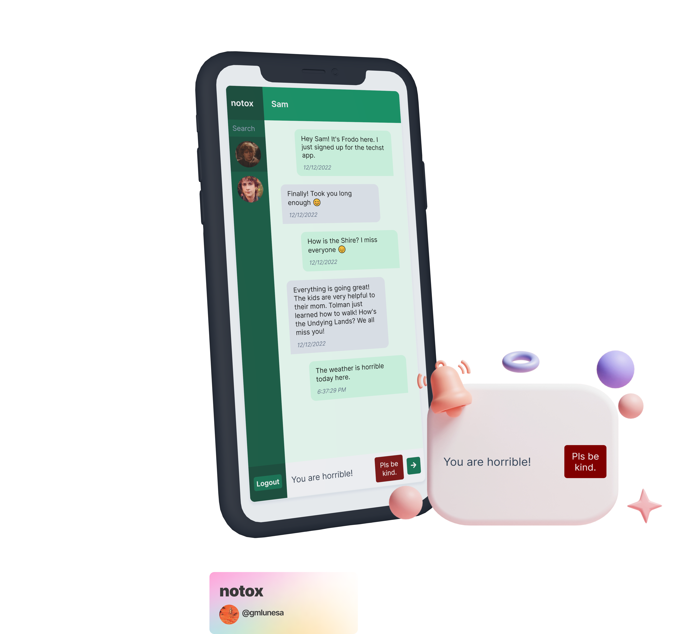

Along with the growing accessibility of the internet across the world, offensive actions across the virtual space have also become increasingly prevalent. According to [Pew Research](https://www.pewresearch.org/internet/2021/01/13/the-state-of-online-harassment/), roughly 4 in 10 Americans have experienced online harrassment. Through machine learning, we can help to improve user experience to avoid negative interactions.

<p class="my-6">
  
</p>

## Using machine learning models

In this blog post, I will provide a walkthrough on how to integrate and use a machine learning model in a chat application to prevent rude messages from being sent. Of course, there is a simple option to identify toxic messages by checking if the message contains a word that is deemed inappropriate. However, this approach may overlook semantic context and may misclassify the message. Take these two sentences for example:

- The weather is **<mark>horrible</mark>**.
- You are **<mark>horrible</mark>**.

If the word horrible was in the list of inappropriate words, the first sentence will be misclassified as toxic. Context _matters_, hence we will harness the power of machine learning to take this a step further.

This project will be using a pre-trained TensorFlow model from [Tensorflow.js](https://www.tensorflow.org/js). The model detects whether the text contains toxic content such as threatening language, insults, obscenities, identity-based hate, or explicit language. It is built on top of the Universal Sentence Encoder ([Cer et al., 2018](https://arxiv.org/pdf/1803.11175.pdf)), a model that encodes text into 512-dimensional embedding and uses the Transformer ([Vaswani et al, 2017](https://arxiv.org/pdf/1706.03762.pdf)) architecture, which is a state-of-the-art method for modelling language.

The model will then be integrated to a React chat application that is bootstrapped with [Techst](https://github.com/gmlunesa/techst/), a plug and play chat platform template.

## Chat platform setup

- Clone the Techst repository (alternative: [Create a repository from a template - GitHub Docs](https://docs.github.com/en/repositories/creating-and-managing-repositories/creating-a-repository-from-a-template))

  ```bash
  git clone https://github.com/gmlunesa/techst.git
  ```

- Install Node modules
  ```bash
  npm install
  ```
- Go to the [Firebase Console](https://console.firebase.google.com).

  - Add a project.
  - Add `Authentication` with `Email/Password` as the `Sign-in method`.
  - Add a `Firestore Database`.
  - Add a `Storage`.

  - Add a `Web` application.

  - Copy the Firebase configuration that has been generated.

- Open the `firebase.sample.js` file, paste and replace the Firebase configuration under the `// TODO: Replace` comment.

  ```js
   // TODO: Replace
   apiKey: 'YOUR_API_KEY',
   authDomain: 'YOUR_AUTH_DOMAIN',
   projectId: 'YOUR_PROJECT_ID',
   storageBucket: 'YOUR_STORAGE_BUCKET',
   messagingSenderId: 'YOUR_MESSAGING_SENDER_ID',
   appId: 'YOUR_APP_ID',
  ```

- Rename the `firebase.sample.js` file to `firebase.js`.

## Tensorflow Integration

Now that the chat application is up and running, we can now incorporate Tensorflow in our app.

- Install relevant Tensorflow packages

  ```bash
  npm install @tensorflow/tfjs @tensorflow-models/toxicity
  ```

- Open `src/components/Input.js`

- Import the load method from the Toxicity model.

  ```js
  // Input.js
  import { load } from "@tensorflow-models/toxicity";
  ```

- Inside the functional component, add the following states.

  ```js
  // Input.js
  const [isToxic, setIsToxic] = useState(false);
  const [isClassifying, setIsClassifying] = useState(false);
  const [hasLoaded, setHasLoaded] = useState(false);
  ```

  - `isToxic`: variable to contain the toxicity assessment from model

  - `isClassifying`: variable to keep track of the classification process

  - `hasLoaded`: variable to keep track whether the model has loaded

- Inside the functional component, insert the useRef hook.

  ```js
  // Input.js
  const model = useRef(null);
  ```

  - `model`: retain the Tensorflow model that will persist for the full lifetime of the Input component

- Inside the functional component, insert the useEffect hook.

  ```js
  // Input.js
  useEffect(() => {
    async function loadModel() {
      const threshold = 0.9;
      model.current = await load(threshold);
      setHasLoaded(true);
    }
    loadModel();
  }, []);
  ```

  - Inside the useEffect hook, we load the model through the `load` method from Tensorflow, which accepts an optional parameter `threshold`. Its default value is `0.85`, but we will tweak it to `0.9`.

  - The `load` method also loads the topology and weights, and returns a Promise which is resolved with the model.

    > **Topology**: a file describing the architecture of a model (what operations it uses) and containing references to the model's weights which are stored externally.
    >
    > **Weights**: binary files containing the model's weights, usually stored in the same directory as topology.
    >
    > Source: [Tensorflow](https://www.tensorflow.org/js/guide/save_load)

- Inside the functional component, add the following code at the top of the `handleSend` method.

  ```js
  // Input.js

  // Set state variables
  setIsSending(true);
  setIsClassifying(true);

  const predictions = await model.current.classify([text]);
  setIsClassifying(false);

  const toxicityResult = predictions[6].results[0].match;

  // Set the state variable with the final prediction result
  setIsToxic(toxicityResult);

  if (!toxicityResult) {
    // Move the message sending code here
  }
  ```

  - The `classify` method takes a parameter of a string array to be evaluated to predict the toxicity. It returns a Promise that is resolved with a `predictions` array.

  - The `predictions` array is an array of objects containing the probabilities for each label. A label is what the TensorFlow model can provide predictions for: `identity_attack`, `insult`, `obscene`, `severe_toxicity`, `sexual_explicit`, `threat`, and `toxicity`. For each toxicity label, there is an array of raw probabilities for each input sentence along with the final prediction. The final prediction can be any of the following:

    - `true` if the probability of a match exceeds the confidence threshold,
    - `false` if the probability of _not_ a match exceeds the confidence threshold, and
    - `null` if neither probability exceeds the threshold.

  - We will be getting the final prediction value from the `toxicity` label, which is the seventh item in the array, hence `predictions[6].results[0].match`.

- We are done with incorporating the TensorFlow model in our code! The next step would be to use the prediction result to show a reminder or not.

  ```jsx
  // Input.js

  {
    isToxic && <ChatReminder>Pls be kind.</ChatReminder>;
  }
  ```

That is it! If a user attempts to send a toxic message, it will filtered out by the machine learning model and will not be sent. A more positive space has now been created 🌱.

## Next steps

While this is an exciting project, running the model and its classification process in the browser's main thread might pose some blockages in the application. I will be looking into the [Web Workers API - Web APIs | MDN](https://developer.mozilla.org/en-US/docs/Web/API/Web_Workers_API) to separate the model's processing logic.

Here are some useful links that you may want to check out:

- [Notox Source Code](https://github.com/gmlunesa/notox)
- [Techst](https://github.com/gmlunesa/techst/)
- [TensorFlowJS](https://www.tensorflow.org/js)
