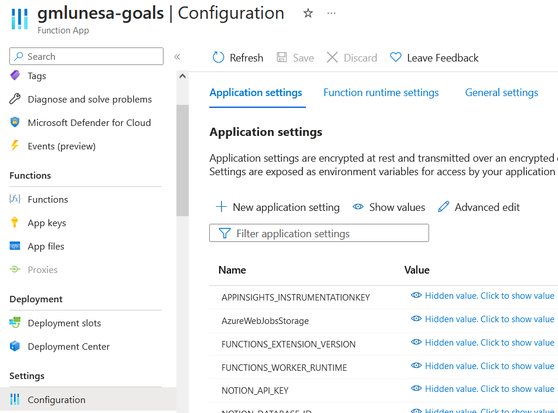
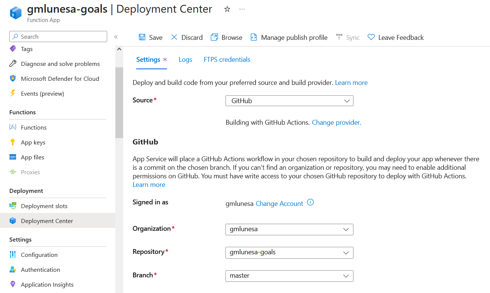

Previously, deploying an application involved tasks such as setting up a virtual machine, implementing security measures, and installing the necessary frameworks. This complex process often resulted in unnecessary costs when the applications were not in use.

However, with the advancement of cloud computing, it is now possible to leverage **serverless computing** for your platform and deployment infrastructure, allowing you to focus solely on coding.

I had a small task that I wanted to do for my website's [Goals](https://gmlunesa.com/goals) page— I needed to access [Notion SDK for Javascript](https://github.com/makenotion/notion-sdk-js), retrieve and format the data for my Gatsby frontend to use. However, it was such a small task that I felt that it did not warrant the hassle to build a whole application to do so, hence, I thought it was a great use case for Azure Functions. In this article, I will share how I used Azure Functions to deploy a serverless Node.js function, from the comfort of my VSCode IDE.

## Prerequisites

I had the following installed:

- An [Azure](https://azure.microsoft.com/en-us/) account with an active subscription.
- Node.js 16.x or above.
- [Azure CLI](https://learn.microsoft.com/en-us/cli/azure/install-azure-cli)
- Visual Studio Code
- [Azure Functions Core Tools](https://learn.microsoft.com/en-us/azure/azure-functions/functions-run-local?tabs=v4%2Cwindows%2Ccsharp%2Cportal%2Cbash#v2)
- Azure Functions extension (optional if using terminal)

## Creating our Azure Function project

On Visual Studio Code, I did the following steps:

- Access the Azure extension on the Activity Bar.
- On **Workspace** Local, click the + button.
- Choose `Create Function`.
- Enter the details on the succeeding prompts.
  - | Prompt               | Selection            |
    | -------------------- | -------------------- |
    | Language             | `Javascript`         |
    | JS Programming Model | `Model V4 (Preview)` |
    | Template             | `HTTP Trigger`       |

If using the Azure CLI, simply type in the following command:

```sh
func new
```

## Run locally

To run the function locally on VS Code:

- Press `F5`.
- Access the Azure extension on the Activity Bar.
- Expand **Workspace** > **Local** > **Functions**.
- Right click and choose `Execute Function Now`.

To run the function locally using the Azure CLI:

```sh
func start
```

## Deploy to Azure

Prior to deploying your function code to Azure, these essential resources must be established:

- [Resource Group](https://learn.microsoft.com/en-us/azure/azure-resource-manager/management/manage-resource-groups-portal): Serves as a logical container for interconnected resources.
- [Storage account](https://learn.microsoft.com/en-us/azure/storage/common/storage-account-overview): Stores and Manages state and other pertinent data related to your functions.
- [Function App](https://learn.microsoft.com/en-us/azure/azure-functions/functions-overview?pivots=programming-language-javascript): Provides the execution environment for your function code; Corresponds to the local function project.

To create these resources, use the following commands using Azure CLI.

- Login to Azure
  - ```sh
    az login
    ```
- Create resource group on the desired region.
  - ```sh
    az group create --name <RESOURCE_GROUP_NAME> --location <REGION>
    ```
- Create a general-purpose storage account in the newly created resource group and desired region.
  - ```sh
    az storage account create --name <STORAGE_NAME> --location <REGION> --resource-group <RESOURCE_GROUP_NAME> --sku Standard_LRS --allow-blob-public-access false
    ```
- Create a function app in Azure.
  - ```sh
    az functionapp create --resource-group <RESOURCE_GROUP_NAME> --consumption-plan-location <REGION> --runtime node --runtime-version <NODE_VERSION> --functions-version 4 --name <FUNCTION_APP_NAME> --storage-account <STORAGE_NAME>
    ```
- Enable the V4 programming model app to run in Azure.
  - ```sh
    az functionapp config appsettings set --name <FUNCTION_APP_NAME> --resource-group <RESOURCE_GROUP_NAME> --settings AzureWebJobsFeatureFlags=EnableWorkerIndexing
    ```

We can now deploy the function app to Azure!

```sh
func azure functionapp publish <FUNCTION_APP_NAME>
```

### Environment Variables

To configure environment variables for local environment:

- Go to `local.settings.json` and add environment variables under **Values**.

To configure environment variables for deployed app:

If using Azure Portal:

- Navigate to your function app.
- Go to **Settings** > **Configuration** > **Application Settings** and add desired environment variables.
<p class="my-6">
  
</p>

If using Azure CLI:

- Run the following command:

  - ```sh
    az functionapp config appsettings set --name <FUNCTION_APP_NAME> \
    --resource-group <RESOURCE_GROUP_NAME> \
    --settings <CUSTOM_KEY>=<VALUE>
    ```

### Continuous Deployment

By leveraging source control integration, Azure Functions lets you to achieve continuous deployment of your code. This integration facilitates a seamless workflow where any updates made to the code automatically trigger the deployment process to Azure.

On the Azure portal:

- Navigate to your function app.
- Go to **Settings** > **Deployment Center** > **Application Settings** and choose the desired `Source`.
- Authorize accordingly.
- Choose the Organization, Repository and Branch where you want your function to be deployed from.
- Review all details and press the `Finish` button.

This is how my settings for my project looks like:

<p class="my-6">
  
</p>

When successfully configured, the code from the specified repository will be deployed to the function app. Any modifications or commits in the deployment source will initiate a deployment process, ensuring that those changes are promptly applied to the function app.

## Remarks

That is it! The whole process of deploying a serverless function is an easy one, especially with the help of relevant Azure extensions on VS Code. I also don't have to worry about racking up server costs.
