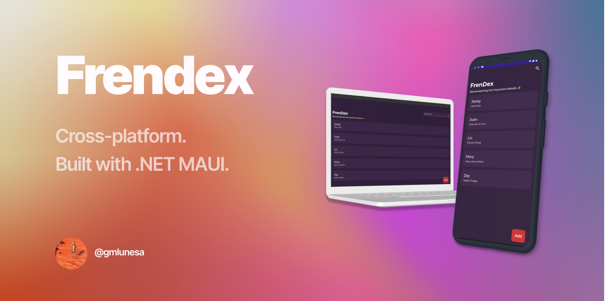
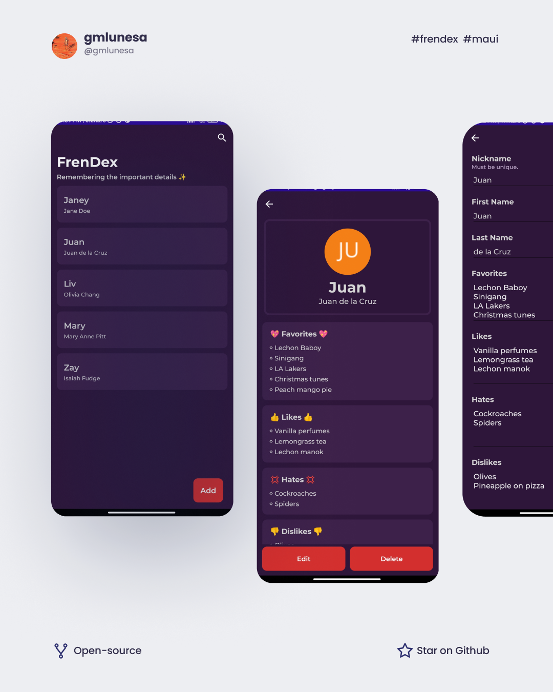
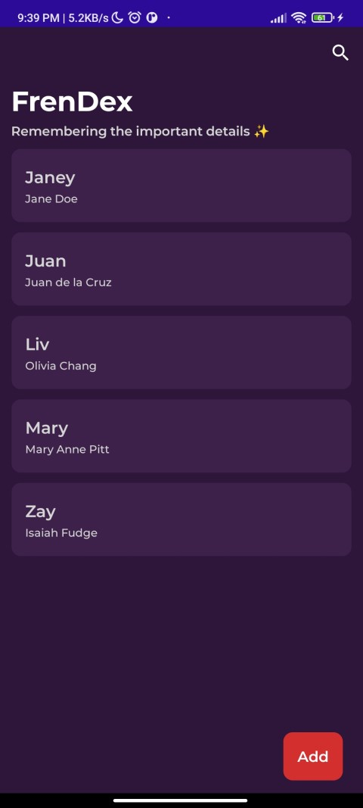
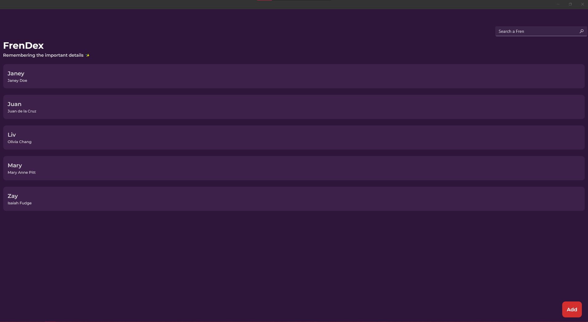
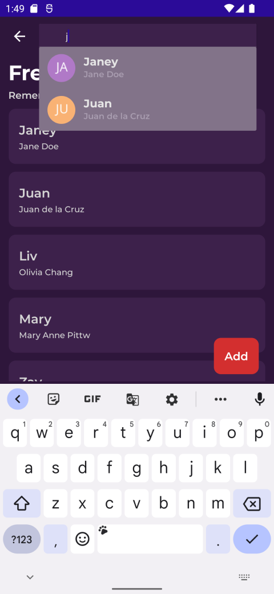
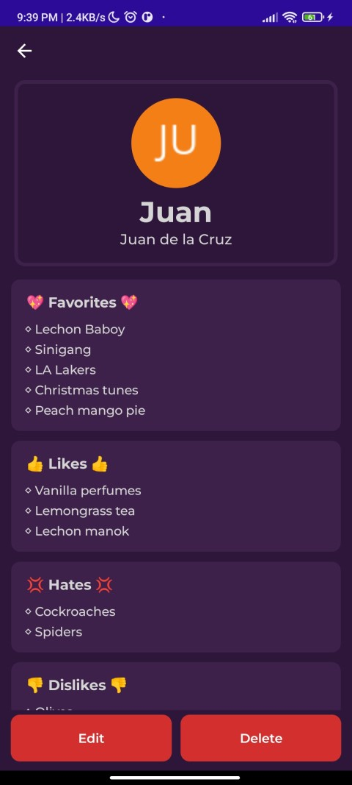

FrenDex is a cross-platform application (Android, iOS and Windows) that allows the user to keep track of information about friends or loved ones.

## Technologies Used

- C#
- .NET MAUI
- SQLITE

## Project Goals

I wanted to create an application that would enable me to take down details about my friends and/or loved ones, in an accessible manner. Trying to memorize everything down to the specific details might not be feasible to some of us especially when we lead busy lifestyles.

**Frendex** is a cross-platform app which assists me in remembering my friends' preferences anytime and anywhere. I could easily record different facts and look them up when I need them. Through Frendex, I am able to enhance my relationships, be organized, and consider my friends' preferences and well-being.

### Features

- Minimalist and seamless UI.
- Single codebase for Windows, Android, iOS and Mac applications.
- MVVM pattern utilization for architecture.
- CRUD functionalities with SQLite database.

### Functionalities

- Add and update "Fren" entries and their corresponding information.
- View "Fren" entries.
- Delete "Fren" entries.
- Search for "Fren" entries.

<figure>
  
  <figcaption>
    <em>Frendex Android: View Friends</em>
  </figcaption>
</figure>

<figure>
  
  <figcaption>
    <em>Frendex Windows: View Friends</em>
  </figcaption>
</figure>

<figure>
  
  <figcaption>
    <em>Frendex Android: Search Friends</em>
  </figcaption>
</figure>

<figure>
  
  <figcaption>
    <em>Frendex Android: View Friends</em>
  </figcaption>
</figure>

## Remarks

.NET MAUI provides an streamlined framework wherein we could deploy applications across multiple types of devices, using only one codebase. Frendex could be installed in Windows, Android and iOS platforms; however since I don't have a MacOS machine I could only generate builds for Windows and Android at the moment.

Through Frendex, I am able to improve my social relationships with others! Here are the specific perks as well.

1. **Improved Personal Relationships**: Keeping track of friends' preferences and interests can help strengthen personal relationships with them. By knowing their favorites, likes, and interests, I can engage in conversations and activities that are more meaningful to them.

2. **Efficient Planning and Organization**: Having a centralized application to store friends' details can make planning and organizing social events or gatherings much easier. I can quickly refer to the application to remember their preferences, making it simpler to choose activities, venues, or gifts that align with their interests.

3. **Respecting Personal Boundaries**: Friends' dislikes and hates are important to consider to ensure I don't inadvertently engage in activities or discussions that may make them uncomfortable. Situations that might cause discomfort or conflicts could be avoided.

4. **Accommodating Allergies and Health Considerations**: Keeping track of friends' allergies and health considerations is crucial, especially when planning meals or events where food or other substances may be involved.

5. **Personalized Gestures and Gifts**: With the detailed information about friends' favorites and interests, gestures and gifts that match their preferences can be personalized.

## Additional details

You might wanna check out how I got started with .NET MAUI! It's very similar to Xamarin development. I wrote about it in my blog entry, [Building a cross platform application with .NET MAUI](https://blog.gmlunesa.com/building-a-cross-platform-application).

If you wish to install Frendex, please download the APK through this [Github link](https://github.com/gmlunesa/frendex/Builds).
