MeowLearn is a concept project that uses the ASP.NET MVC framework to build a fullstack e-learning platform.

> Please take note that the live demo might be taken down from time to time to save on my personal Azure budget.
>
> If you would like to view the deployed project, please do contact me through this site or through [email](mailto:gmlunesa@gmail.com).

## Technologies Used

- ASP.NET MVC
- Azure App Service
- Azure SQL Server

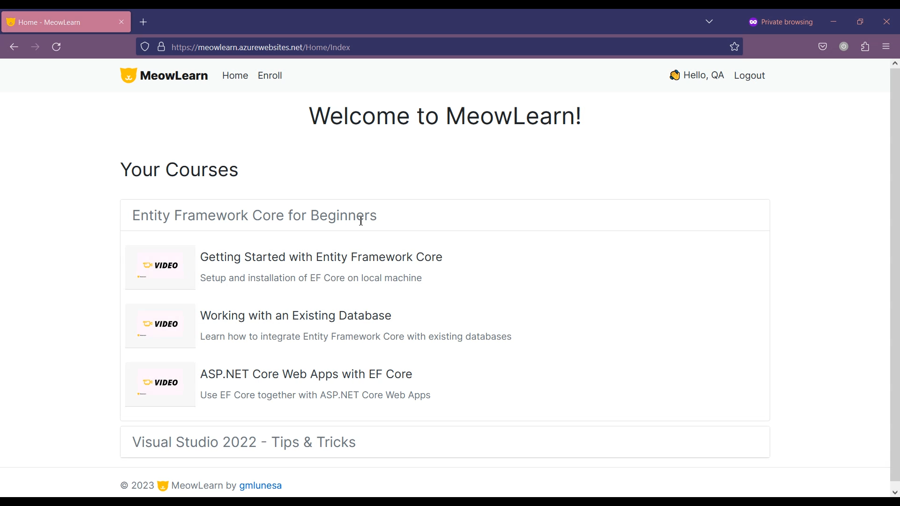

## Features

- Register and Login
- Admin functionality
- Enroll in a course
- View lessons

### Register and Login

Authorization and authentication is managed by the ASP.NET Identity Framework.

### Admin Functionality

- The admin can create, modify and delete courses.
- Under each course, multiple lessons could be added.
- The admin can create, modify and delete lessons.
- Each lesson has its own content.
- A lesson could also have its own media type for viewing purposes.

- The admin can assign courses to the different users.
- The admin can also create, modify and delete media types, applicable to lessons.

<figure>
  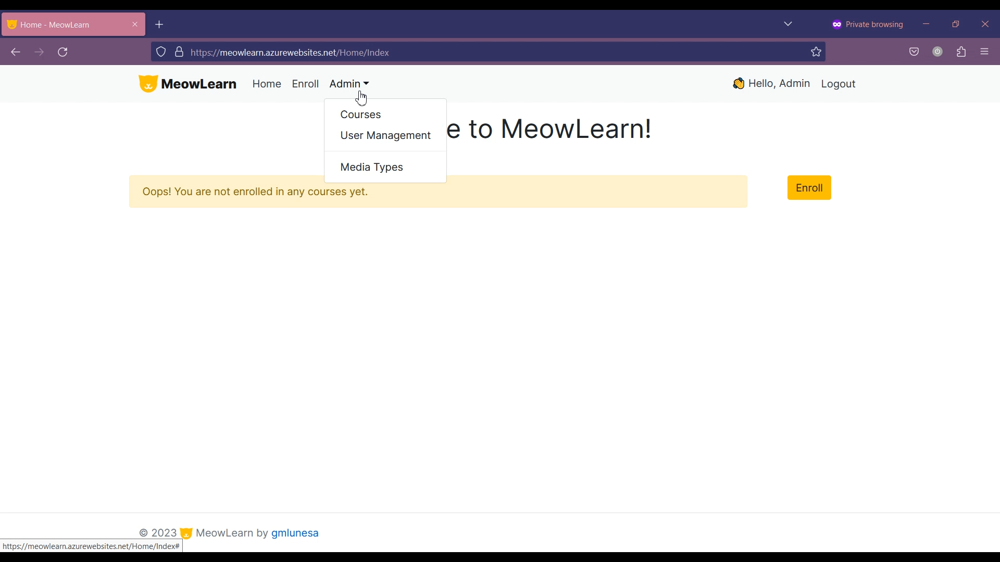
  <figcaption>
    <em>MeowLearn Admin Functionalities: Course Management, User Management, Media Type Management</em>
  </figcaption>
</figure>

<figure>
  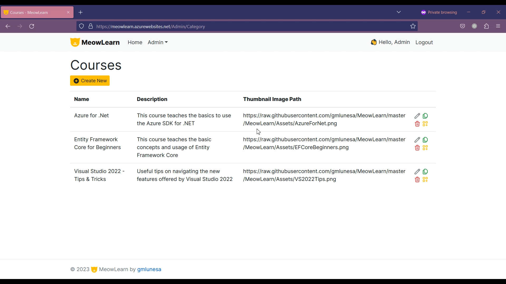
  <figcaption>
    <em>MeowLearn Admin Functionalities: Manage Courses</em>
  </figcaption>
</figure>

<figure>
  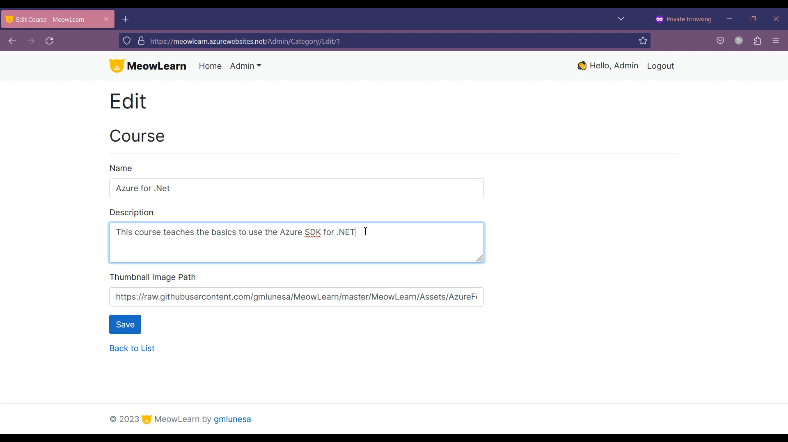
  <figcaption>
    <em>MeowLearn Admin Functionalities: Edit a Course</em>
  </figcaption>
</figure>

<figure>
  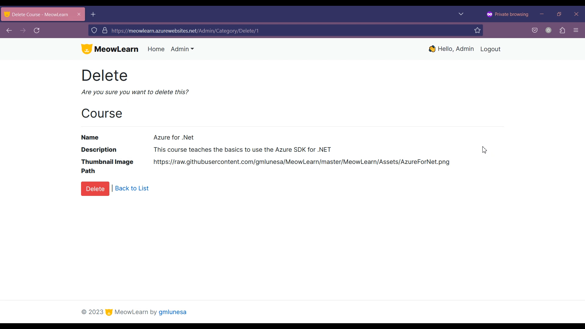
  <figcaption>
    <em>MeowLearn Admin Functionalities: Delete a Course</em>
  </figcaption>
</figure>

<figure>
  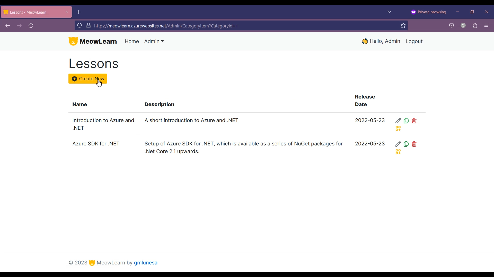
  <figcaption>
    <em>MeowLearn Admin Functionalities: Manage Lessons</em>
  </figcaption>
</figure>

<figure>
  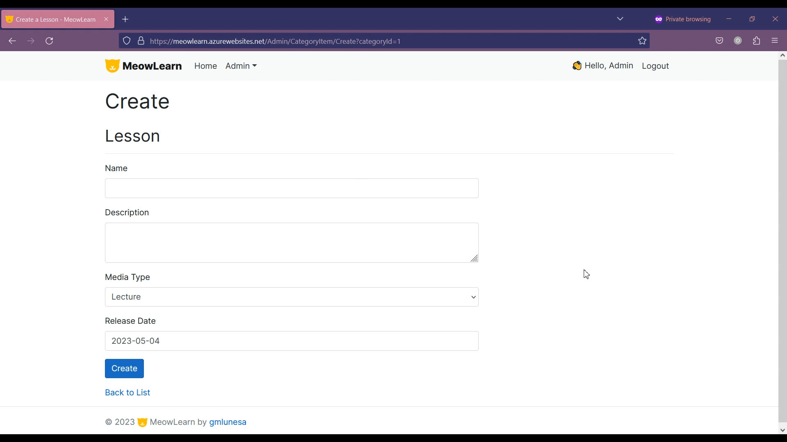
  <figcaption>
    <em>MeowLearn Admin Functionalities: Create Lesson Content</em>
  </figcaption>
</figure>

<figure>
  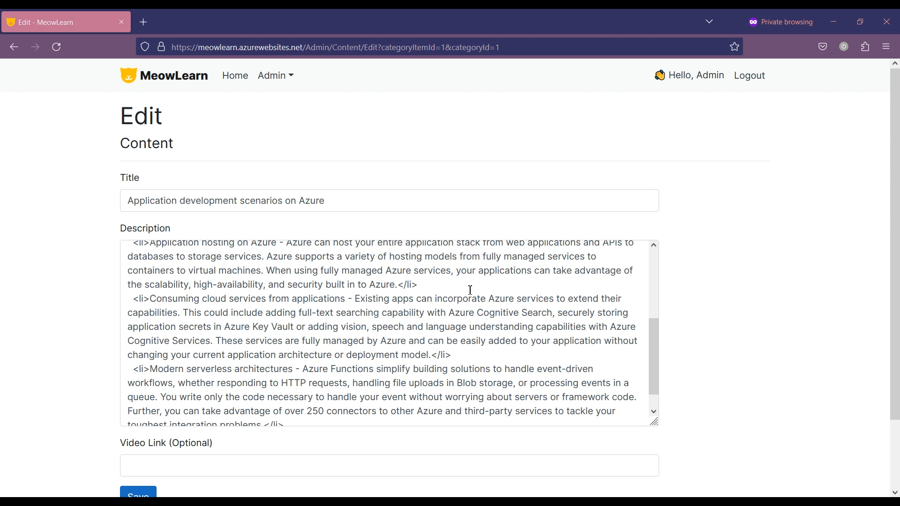
  <figcaption>
    <em>MeowLearn Admin Functionalities: Edit Lesson Content</em>
  </figcaption>
</figure>

<figure>
  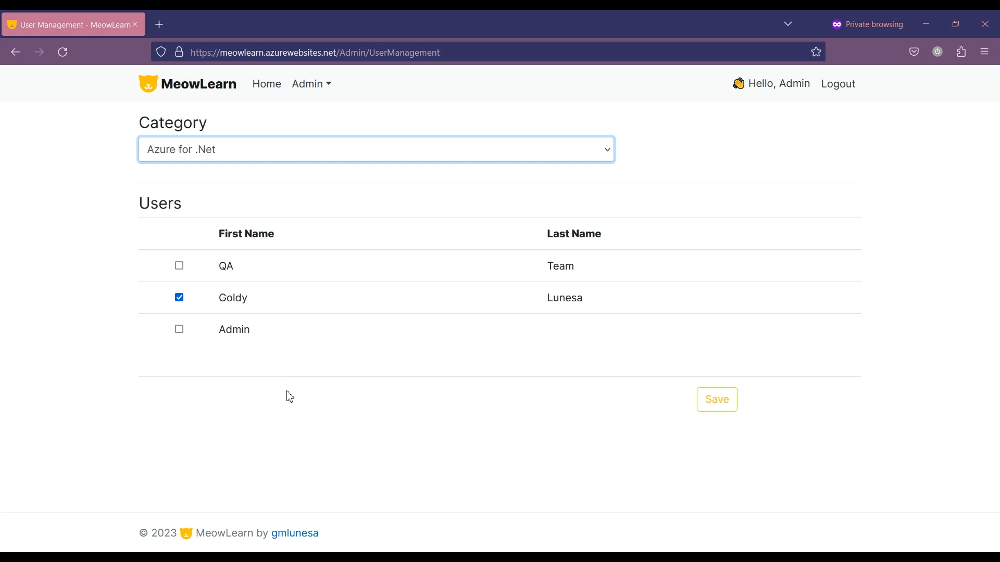
  <figcaption>
    <em>MeowLearn Admin Functionalities: Manage Users</em>
  </figcaption>
</figure>

<figure>
  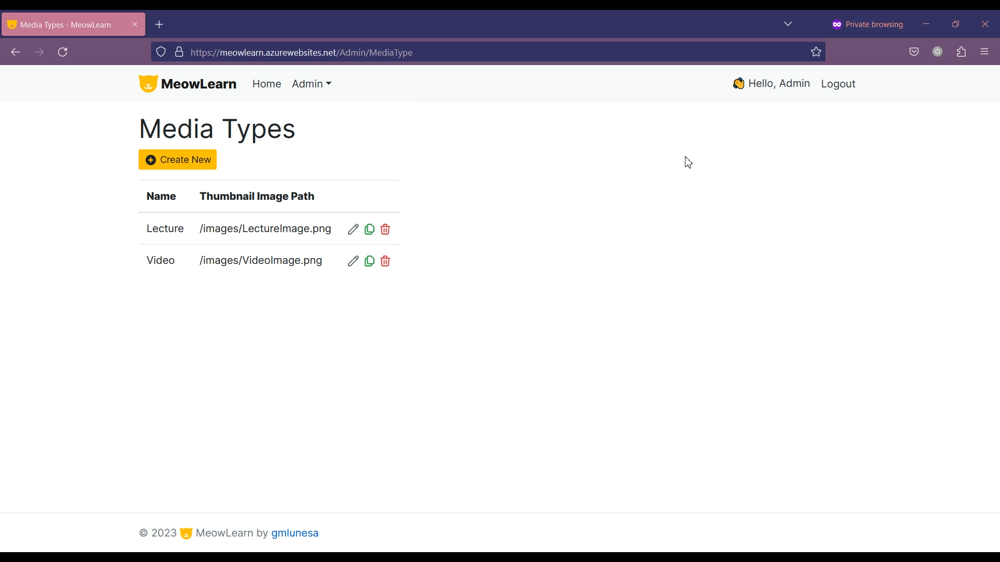
  <figcaption>
    <em>MeowLearn Admin Functionalities: Manage Media Types</em>
  </figcaption>
</figure>

### Enroll in a course

Users are able to add or remove course membership.

<figure>
  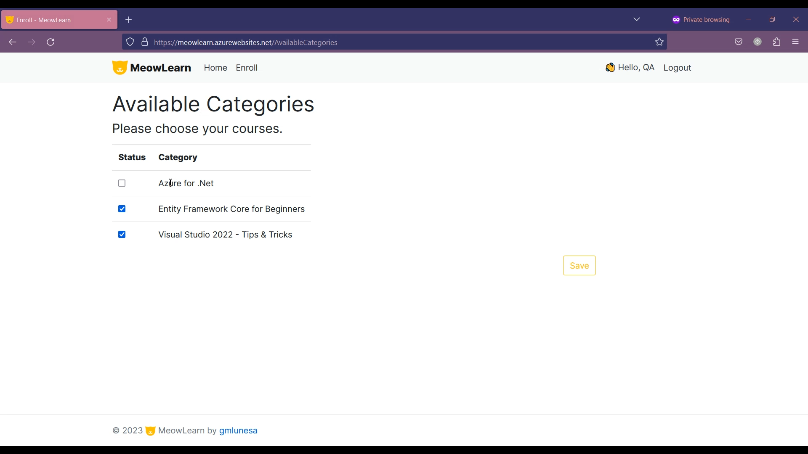
  <figcaption>
    <em>MeowLearn User Functionalities: Enroll Course</em>
  </figcaption>
</figure>

<figure>
  
  <figcaption>
    <em>MeowLearn User Functionalities: View Enrolled Courses</em>
  </figcaption>
</figure>

### View lessons

Users who are enrolled in a course are able to view lessons, which can contain text (with HTML syntax) and in-line videos.

<figure>
  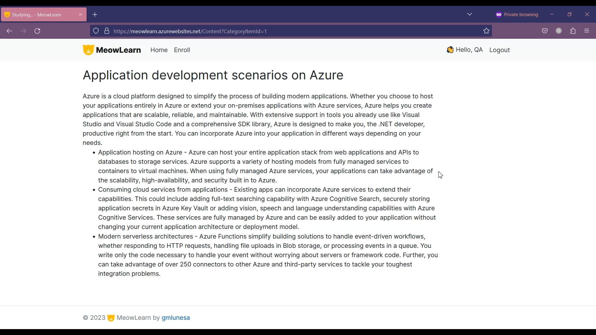
  <figcaption>
    <em>MeowLearn User Functionalities: Read Lesson</em>
  </figcaption>
</figure>

<figure>
  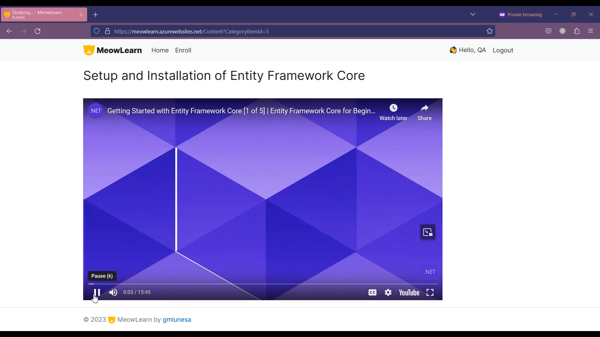
  <figcaption>
    <em>MeowLearn User Functionalities: Watch Lesson</em>
  </figcaption>
</figure>

## Remarks

A video preview of MeowLearn is available on [Youtube](https://youtube.com).

As mentioned, please take note that the live demo might be taken down from time to time to save on my personal Azure budget. If you would like to view the deployed project, please do contact me through this site or through [email](mailto:gmlunesa@gmail.com), so I can get it up and running for you.
