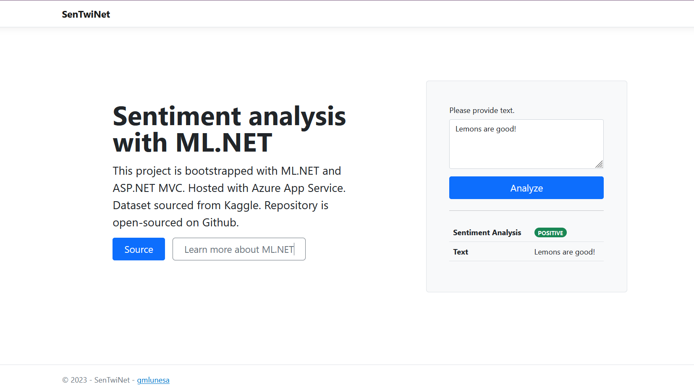

SenTwiNet is a sentiment analysis tool that utilizes ML.NET and is bootstrapped with ASP.NET MVC.

## Technologies Used

- ML.NET
- Visual Studio
- Azure App Service



## Case Problem

ML.NET is an open source and cross-platform machine learning framework released by Microsoft. It allows the ability to add machine learning to .NET applications.

I wanted to try out ML.NET through making a web app that takes user input and classifies its sentiment. The sentiment classifier uses ML.NET to create a model that makes a prediction.

## Process

1. Explore documentation

   The official [Microsoft Docs](https://learn.microsoft.com/en-us/dotnet/machine-learning/) were read to be able to have a brief background on ML.NET.

2. Download and prepare dataset

   The dataset used in this project is the [Twitter and Reddit Sentimental analysis Dataset](https://www.kaggle.com/datasets/cosmos98/twitter-and-reddit-sentimental-analysis-dataset). The two files from the downloaded archive were aggregated in a single input file.

   The input dataset has a text containing a Twitter post or a Reddit comment, each with a sentiment label that ranges -1 to 1.

   - 0 indicates neutral sentiment
   - 1 indicates positive sentiment
   - -1 indicates negative sentiment

   | SentimentText           | SentimentLabel |
   | ----------------------- | -------------- |
   | shah looks nervous      | 0              |
   | this is a good one hehe | 1              |
   | this is very sad        | -1             |

3. Create class

   A data model was added to represent sentiment prediction.

   ```cs
    /** SentimentPredictionModel.cs **/
    public class SentimentPredictionModel
    {
        public string SentimentText { get; set; }
        public string PredictedLabel { get; set; }
    }
   ```

4. Train and evaluate a model

   With the help of the ML.NET model builder, an optimal algorithm was chosen based on which performed the best during Model Builder's exploration. In this project, around 28 algorithms were explored, with [L-BFGS Maximum Entropy Multiclass trainer](https://learn.microsoft.com/en-us/dotnet/api/microsoft.ml.trainers.lbfgsmaximumentropymulticlasstrainer?view=ml-dotnet) yielding the highest accuracy. A trained model is then generated.

5. Consume model

   An ASP.NET MVC project was created to consume the model and allow users to interact with it.

   In the following code snippet from HomeController.cs, it is demonstrated how the model is called to predict. The prediction output is then formatted to be readily used by the front-end.

   ```cs

    /** HomeController.cs **/

    //Load model and predict output
    var output = MLModel.Predict(modelInput);

    SentimentPredictionModel prediction = new SentimentPredictionModel
    {
        SentimentText = sentimentData.SentimentText,
        PredictedLabel = output.PredictedLabel,
    };

   ```

6. Deploy web app to Azure App Services

   The ASP.NET MVC app was then deployed to Azure App Services.

   ```sh
     az webapp up --sku F1 --name SenTwiNet --os-type windows
   ```

## Remarks

ML.NET provides a high-level entry towards C# and .NET developers who would like to learn more about Machine Learning. The models generated are easy to integrate to .NET applications.

To learn more, please visit the official [Microsoft Documentation](https://learn.microsoft.com/en-us/dotnet/machine-learning/).
